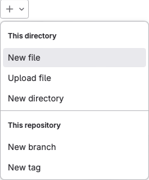

<style>
.info {
  width: 60;
  height: 60;
  float: left;
}
</style>

# Introduction a GitLab CI / CD

## Le pipeline

Lorsqu'on parle de CI / CD, un mot qui vient souvent à l'esprit est : Pipeline. En effet, le pipeline illustre parfaitement ce que nous faisons ici : transporter le code depuis le repo vers la production.

Dans l'entreprise, les demandes affluent, pour faire face à l'accélération des développements, l'équipe décide de mettre en place un pipeline d'intégration continue.

Jusque là, notre équipe de développement a bien travaillé sur le code : celui-ci est de bonne qualité, compile et comporte même des tests.

Pour nous assurer que la qualité reste au moins aussi bonne qu'actuellement, nous allons demander à gitlab de vérifier chaque commits fait sur ce projet.

 Dans le contexte de cet exercice, nous exploiterons votre projet example_project.

## Notre premier pipeline

Pour créer un pipeline il suffit de créer un fichier nommé .gitlab-ci.yml à la racine du repository.



 Saisissez directement son nom dans le champ texte : **.gitlab-ci.yml** (le premier ‘.’ est important. Ce n’est pas une erreur.)


 
Voici le code de notre premier pipeline. (vous pouvez copier-coller)

```yml
job:
  script:
    - echo "Hello World"
```

**Commitez** ce fichier dans une nouvelle branche. Et créez une **merge request** vers le repository source. Sur la merge request, vous pouvez voir apparaître un nouvel élément :


Si ce n'est pas le cas, vérifier le paramétrage CI/CD du projet et l'activation des shared runners


Vous pouvez aussi naviguer vers la section **Build > Pipelines** pour afficher une liste de tous les pipelines qui ont été exécutés sur le projet.


Si vous cliquez sur le pipeline que vous avez déclenché, une vue s'affiche. Elle nous montre les étapes du pipeline et leur état. Pour l'instant bien sûr, il est très simple, mais par la suite on pourra avoir plus de détails ici.
Cliquez ensuite sur l'une des étapes pour avoir des détails sur l'exécution.


Nous allons essayer de comprendre ensemble ce qu'il s'est passé.

