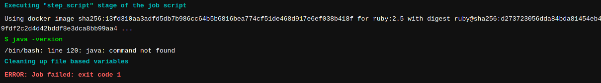
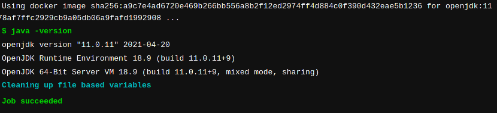
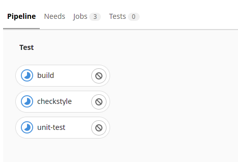

# Introduction a GitLab CI / CD

## Choisir un environnement d'exécution

Lors de la création de notre pipeline, nous avons été en mesure d'exécuter un script sur la base de code de notre projet. Ce script ne fait malheureusement pas grand chose. Nous allons y remédier. Comme notre projet est un projet java, nous allons avoir besoin d'un jdk pour construire le projet.  

Il est possible d'éditer votre code au travers de l'interface Gitlab en utilisant, soit le WebIDE soit le pipeline editor. Pour l'édition rapide d'un pipeline, la solution la plus simple reste le Pipeline Editor. Celui-ci se trouve dans la section Build > Pipeline Editor de Gitlab.

Nous allons donc vérifier si l'environnement d'exécution contient les outils adaptés :

```yml
job:
 script:
   - java -version
```

Cette commande devrait avoir pour effet de nous afficher la version de java disponible dans l'environnement d'exécution GitLab.

Poussez vos changements dans gitlab pour lancer le pipeline.
Dans le pipeline associé à votre merge request, vous devriez trouver ce genre d'output.



La phase d'exécution nous retourne une erreur. En effet, l'image ruby (celle utilisée par défaut) ne contient pas de JDK.

Il va falloir modifier notre pipeline pour charger une image adéquate.  

```yml
job:
 image: openjdk:11
 script:
   - java -version
```

Poussez vos changements pour lancer le pipeline.

Cette fois le pipeline nous a donné un succès !



## Construire l'application

Maintenant que nous avons l'environnement Java pour notre pipeline, nous allons construire notre application. Pour cela, il nous faut modifier la commande utilisée:

```yml
build:
 image: openjdk:11
 script:
   - ./mvnw package
```

Nous en profitons également pour renommer l'étape de build (le nom du job). Pour permettre une meilleure lecture de ce qu'il se passe dans le build, nous nommerons ce job: **build**. Vous pouvez pousser ces changements pour voir les résultats sur le pipeline

Comme nous souhaitons avancer dans notre pipeline de CI / CD, compiler l'application ne suffit pas. En effet, le pipeline est censé gérer tout le cycle de vie de l'application depuis le code source jusqu'à son déploiement en production.

Nous allons ajouter d’autres étapes à notre pipeline. L'une d'elles aura pour but la vérification des bonnes pratiques de développement (avec checkstyle). La seconde se chargera de vérifier que l'on a pas introduit de bug en lançant notre suite de test

```yml
default:
 image: openjdk:11

build:
 script:
   - ./mvnw package
checkstyle:
 script:
   - ./mvnw checkstyle:check
unit-test:
 script:
   - ./mvnw test
```

 Notez : comme plusieurs jobs vont utiliser la même image, nous avons ici défini l'image par défaut pour le pipeline. Comme vous pouvez le voir dans l'exemple ci dessus, il suffit de placer la définition de l'image dans un bloc **“default“** à la racine du fichier .gitlab-ci.yml

Vous pouvez pousser ces changements pour voir comment ils influent sur le pipeline.

Le résultat devrait ressembler à :


