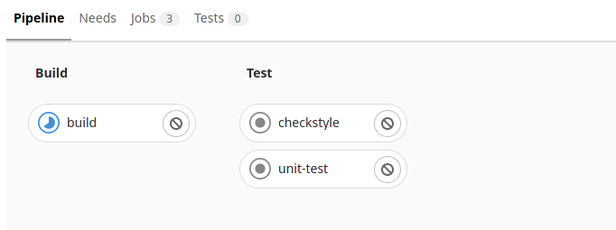

# Introduction à GitLab CI / CD

## Controller le flow d'Execution

Nous avions précédemment créé un simple pipeline, qui nous permettait de réaliser plusieurs étapes en parallèle. Cependant, certaines étapes clés ont besoin d'attendre la validation d'étape préliminaire pour être exécutées. On imagine mal, par exemple, de déployer en production avant que les tests ne se soient effectués.

Pour configurer ce genre de dépendance, nous allons commencer par utiliser la directive **stage**

Modifions notre fichier de configuration de la manière suivante :

```yml
default:
 image: openjdk:11

build:
 stage: build
 script:
   - ./mvnw package
checkstyle:
 stage: test
 script:
   - ./mvnw checkstyle:check
unit-test:
 stage: test
 script:
   - ./mvnw test
```

Cette fois encore, pour voir les résultat de ces changements, nous allons pousser la branche sur GitLab

Notre pipeline a pris une nouvelle forme :



 Rappel: Les job du stage Test (checkstyle et unit-test) ne seront pas exécuté tant que le job du stage Build ne sera pas validé

Vous l'avez peut-être constaté, mais ce pipeline est presque deux fois plus long que le précédent. En effet, comme nous agissons de façon séquentielle plutôt qu'en parallèle, il est aisé de comprendre que le temps est presque doublé dans cette situation.

Comme nous souhaitons conserver la flexibilité offerte par ce flow d'exécution, nous allons tenter de mitiger ce problème.

## Optimiser les performances au Build

Pour permettre au pipeline de s'exécuter plus rapidement, nous allons l'empêcher de refaire certaines actions à chaque fois qu'il s'exécute. Dans le cas présent, nous allons nous concentrer sur le téléchargement des dépendances. Ce téléchargement est souvent très long quand le projet grandit. C'est pourtant une action dont nous nous passons au quotidien sur nos postes de développement : en effet de nombreux outils conservent un cache en local sur nos machines pour éviter de perdre du temps.  Nous allons mettre en place la même chose sur l'environnement GitLab [Predefined variables reference | GitLab](https://docs.gitlab.com/ee/ci/variables/predefined_variables.html)

```yml
default:
 image: openjdk:11
 cache:
   key:
     files:
       - pom.xml
     prefix: ${CI_JOB_NAME}
   paths:
     - .cache

build:
 stage: build
 script:
   - ./mvnw package
checkstyle:
 stage: test
 script:
   - ./mvnw checkstyle:check
unit-test:
 stage: test
 script:
   - ./mvnw test
```

Quelques explications s'imposent ici. En effet, il est possible de configurer le cache pour chaque job. Dans notre cas, la configuration sera similaire pour tous les jobs, nous avons donc pris la liberté de configurer un cache par défaut.

Nous allons mettre en cache le fichier .cache (qui contient le cache des dépendances utilisé par notre outil de build : maven).
Dans la définition du cache, nous nous servons du pom.xml. Ce fichier contient la liste des dépendances qui seront téléchargées par maven. La directive key > files permet d'utiliser le checksum de ce fichier comme une clé permettant d'identifier le cache. Si ce fichier change, son checksum sera différent. GilLab créera alors une nouvelle version du cache.

Dans notre cas, chaque job ne s'appuie pas nécessairement sur toutes les dépendances en une fois. Par exemple, le job de checksum se contente de télécharger le plugin du même nom. Il n'a pas besoin de télécharger les dépendances applicatives.

Le préfixe nous permettra dans ce cas de créer une clé de cache composé : ainsi comme chaque job s'appuie sur la même version du pom.xml, il nous est possible de créer un cache dédié par nom de job. Le fait d'avoir un cache plus petit (plus spécialisé) nous permettra de gagner quelques secondes au moment de créer / charger le cache.

Comme vous en avez l'habitude, vous pouvez voir le résultat en poussant votre travail dans GitLab.

 Cette fois-ci il y a cependant une petite nuance. La première fois que ce pipeline s'exécute, le cache n'existe pas. On peut donc observer dans les logs des différents jobs que Maven va bien aller télécharger les dépendances. Cependant, si on relance un pipeline sur notre branche, nous pouvons observer que pendant les exécutions suivantes, le cache est utilisé et évite à Maven de tout recommencer.

## Implémenter le workflow de développement

Notre application est enfin prête à partir en production. L'équipe va désormais se concentrer sur les dernières étapes de notre pipeline. Comme nous ne disposons pas d'un environnement de production à proprement parler, nous simulons cette étape de mise en production. Pour cela, on se contentera de pousser une image docker dans un endroit de stockage dédié : le package registry de gitlab.

Nous commencerons donc par l'ajout d'un nouveau job.

```yml
...

docker-build:
 image: docker:latest
 stage: deploy
 services:
   - docker:dind
 before_script:
   - docker login -u "$CI_REGISTRY_USER" -p "$CI_REGISTRY_PASSWORD" $CI_REGISTRY
 script:
   - docker build --pull -t "$CI_REGISTRY_IMAGE" .
   - docker push "$CI_REGISTRY_IMAGE"
```

Rappels: les **services** permettent d'utiliser des outils autour de notre build. Le service docker:dind (dind pour docker in docker) nous permet de lancer des commandes docker alors même que nous nous trouvons dans un conteneur.

Ici nous découvrons un nouvel attribut: **before_script**. Il nous permet de configurer ou de lancer certaines actions avant d'exécuter le script de notre job. Comme vous pouvez le lire : on va utiliser ce **before_script** pour se connecter à la **registry** GitLab

Poussez ces changements.

Le pipeline se lance. Comme toute équipe DevOps qui se respecte, c'est le moment que vous choisissez pour aller prendre un café : en effet un build prend quelques minutes c'est le moment idéal.

Revenue de votre pause, vous devriez voir quelque chose comme ceci :


C'est à ce moment que notre CTO vient nous tapoter sur l'épaule. Il nous annonce qu'un problème est survenu en prod… En effet, notre version de développement vient d'être déployée par mégarde.

Nous avons oublié de changer le flux d'exécution pour intégrer les spécificités de notre workflow: seule la branche main ou production doit permettre de déployer notre projet. En attendant d'entreprendre des changements plus risqués. Nous décidons de faire un quick fix qui nous permettra de choisir quelle branche déployer et à quel moment.

Nous utiliserons la directive when pour demander à GitLab de ne lancer le dernier job que dans certaines conditions.

```yml
...

docker-build:
 image: docker:latest
 stage: deploy
 services:
   - docker:dind
 before_script:
   - docker login -u "$CI_REGISTRY_USER" -p "$CI_REGISTRY_PASSWORD" $CI_REGISTRY
 script:
   - docker build --pull -t "$CI_REGISTRY_IMAGE" .
   - docker push "$CI_REGISTRY_IMAGE"
 when: manual
```

Vous pouvez pousser les changements pour voir comment le pipeline évolue.

 options possibles pour le when. Celle que nous avons choisie : manual permet de décider si oui ou non nous devrons lancer ce job. Ce choix sera disponible sous la forme d'un bouton


N'hésitez pas à lancer cette étape, pour voir comment cela se traduit dans GitLab. Dans notre cas, on ne risque pas de casser grand chose.

Cette condition va nous permettre d'avancer plus sereinement. Même si elle n'implique pas de suivre le processus, elle sera là en garde fou. Nous allons maintenant pouvoir travailler sur une solution plus pérenne.

Nous pourrons par exemple utiliser la directive **only**, comme son nom l'indique. Celle-ci permettra de choisir sous quelles conditions notre job sera créé. Nous choisissons donc de ne créer ce job que pour les branches **main** et **production** :

```yml
...

docker-build:
 image: docker:latest
 stage: deploy
 services:
   - docker:dind
 before_script:
   - docker login -u "$CI_REGISTRY_USER" -p "$CI_REGISTRY_PASSWORD" $CI_REGISTRY
 script:
   - docker build --pull -t "$CI_REGISTRY_IMAGE" .
   - docker push "$CI_REGISTRY_IMAGE"
 when: manual
 only:
   refs:
     - main
     - production
```

Une nouvelle fois, vous pouvez pousser les changements et observer le pipeline qui est produit.
