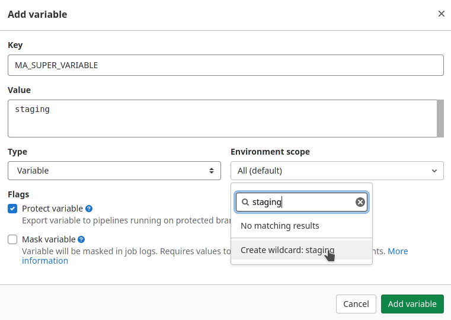
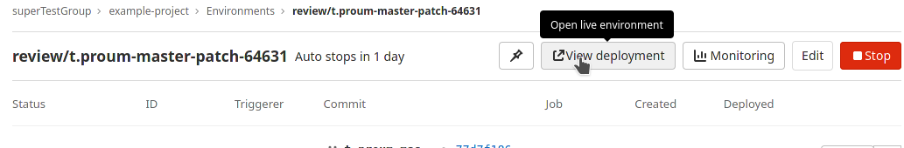

# Environnements et Review Apps

## Créer un environnement

Comme notre processus prévoit la mise en place de deux environnements: staging et production, nous allons les créer dans gitlab. Bien sûr, un environnement n'aura aucune valeur, si il n'a pas de moyen de configurer l'application qu'il héberge d'une manière ou d'une autre.

Pour illustrer cette différence de configuration, nous allons créer des variables qui permettent de spécifier au pipeline quel env est utilisé.

Sur notre projet, rendez vous dans  la section Settings > CI/CD


Dépliez ensuite la partie Variables. Nous allons ajouter une variable pour notre environnement de staging :



Remplissez le formulaire comme indiqué ci-dessus. Dans le champ de sélection des environnements, on nous propose de créer l'environnement de staging  (celui-ci n'existe pas encore) Cliquez sur **Create wildcard: staging**. Puis cliquez sur **Add Variable** pour terminer la création de cette variable.

 Il n'est pas possible de créer deux variables qui portent le même nom. Sauf si celles-ci concernent deux environnements différents. C'est notre cas ici, donc tout va bien.

Réitérer l'opération avec cette fois l'environnement scope : **production**. La **valeur** de la **variable** sera bien sûr adaptée aux circonstances : dans ce cas, nous choisirons: **production**.

Éditez ensuite le pipeline pour prendre en compte ces différentes variables:
Ajoutez par exemple un job :

```yml
...
echo-vars-staging:
 stage: test
 script:
   - echo $MA_SUPER_VARIABLE
 environment:
   name: staging
echo-vars-production:
 stage: test
 script:
   - echo $MA_SUPER_VARIABLE
 environment:
   name: production
```

Poussez ce fichier sur gitlab et observez le résultat.


Notre nouveau pipeline va créer et même notifier les environnements staging et production qu'ils vont être modifiés ou accédés par ce pipeline.

 Bien sûr, en condition réelle, il aurait été souhaitable de filtrer les branches que nous souhaitions déployer. Ici nous nous intéresserons aux interactions avec l'environnement.

## Explications

 Pour des raisons de sécurité, les variables que nous avons créées ne sont disponibles que pour les pipelines exécutés depuis une branche protégé.
Ceci évite par exemple qu'un développeur ne dévoile sans le vouloir un secret ou n'utilise malencontreusement une variable destiné à la production pendant ses développements

Pour résoudre ce problème il suffirait de merger ce code sur une branche protégé. Merger donc ce code sur main, puis suivez le processus pour mettre en production ce code en suivant le workflow **Production Branch** vu précédemment.

## Review Apps

Le processus peut-être relativement complexe en suivant la stratégie Production branche. Il faudra créer un environnement, un job par environnement ainsi qu'un set de variables. Voyons maintenant comment les review apps peuvent nous aider à enrichir et simplifier ce processus.

Notre flux de développement s'accélère encore, l'entreprise fait face à une croissance sans précédent. Notre workflow actuel ne nous permet plus de suivre la cadence. Nous optons donc pour une nouvelle stratégie qui permettra à nos testeurs de travailler main dans la main avec les développeurs.

Dans ce nouveau workflow, nous souhaitons qu'un maximum de travail de vérification soit effectué avant d'avoir à intégrer le code dans la branche par défaut.

En effet, beaucoup d'efforts sont nécessaires pour trouver les bugs et les fixer lorsque le code est mis en commun. Il faut retrouver quel commit a causé le problème, retrouver ensuite le bon interlocuteur pour fixer le code, le bon interlocuteur pour valider que les spécifications étaient les bonnes etc.

De plus, les personnes concernées sont déjà concentrées sur leur prochaine feature. Ce changement de contexte risque de leur faire perdre pas mal de temps.

Pour changer cela, nous décidons de mettre en place des environnements dynamiques. Ceux-ci nous permettront de valider toutes les étapes de notre processus de vérification pour chaque branche.

L'idée est de créer automatiquement un environnement complet pour chaque branche :

```yml
...
review:
 image: docker:latest
 stage: test
 script:
   - echo "deploy our review app"
 environment:
   name: review/$CI_COMMIT_REF_NAME
   url: https://gitlab.com/$CI_PROJECT_NAMESPACE/$CI_PROJECT_NAME/-/tree/$CI_COMMIT_REF_NAME
   auto_stop_in: 2 days
 needs:
   - build
```

Nous en profitons pour retirer de notre pipeline les jobs echo-vars-staging et echo-vars-production créés précédemment. Celles-ci ne seront d'aucune utilité dans cette nouvelle version. Poussez ces changements.

 Ici l'url de la review app nous donne accès au code poussé sur la branche courante. En effet, la création et l'administration d'un environnement physique ou logique n'est pas couvert par cette formation. Cette redirection permet néanmoins de comprendre le principe.

Vous pouvez observer que le pipeline a évolué comme suit :


Ce nouveau pipeline nous laisse la possibilité de tester notre application en allant rejoindre l'application déployé : cliquez sur le job **review**

En haut de l'écran vous trouverez une référence à l'environnement qui a été créé :


Cliquez sur ce lien pour accéder à cet environnement.



Cliquez ensuite sur view environnement pour accéder à la review app.

## Aller plus loin

Notre review app nous permet de visualiser le résultat de nos développements à travers un environnement dédié. Cependant, cette étape ne permet pas d'imposer un workflow, en effet il est possible de déployer par mégarde sans réel approbation suite à la review. Vous trouverez ci dessous un exemple complet qui nous permettra de créer un pipeline plus verrouillé.

La mise en place de ce pipeline s'inspire d'un set de bonne pratique issue de l'expérience acquise autour de CI / CD (vous trouverez plus d'information à ce sujet ici : [Progressive Delivery: How to get started with Review Apps](https://about.gitlab.com/blog/2019/04/19/progressive-delivery-using-review-apps/) )

```yml
stages:
 - build
 - test
 - review
 - deploy

default:
 image: openjdk:11
 cache:
   key:
     files:
       - pom.xml
     prefix: ${CI_JOB_NAME}
   paths:
     - .cache

build:
 stage: build
 script:
   - ./mvnw package
checkstyle:
 stage: test
 script:
   - ./mvnw checkstyle:check
 needs: []
unit-test:
 stage: test
 script:
   - ./mvnw test
 needs: []
review:
 image: docker:latest
 stage: test
 script:
   - echo "deploy our review app"
 environment:
   name: review/$CI_COMMIT_REF_NAME
   url: https://gitlab.com/$CI_PROJECT_NAMESPACE/$CI_PROJECT_NAME/-/tree/$CI_COMMIT_REF_NAME
   auto_stop_in: 2 days
 needs:
   - build
accept-review:
 image: docker:latest
 stage: review
 script:
   - echo "the app is ready, shutdown our review app"
 environment:
   name: review/$CI_COMMIT_REF_NAME
   url: https://gitlab.com/$CI_PROJECT_NAMESPACE/$CI_PROJECT_NAME/-/tree/$CI_COMMIT_REF_NAME
   action: stop
 when: manual
 needs:
   - review
docker-build:
 needs:
   - accept-review
 image: docker:latest
 stage: deploy
 services:
   - docker:dind
 before_script:
   - docker login -u "$CI_REGISTRY_USER" -p "$CI_REGISTRY_PASSWORD" $CI_REGISTRY
 script:
   - docker build --pull -t "$CI_REGISTRY_IMAGE" .
   - docker push "$CI_REGISTRY_IMAGE"
 when: manual
```

Ce pipeline est plus complexe que précédemment :


En effet nous avons inclus un nouveau stage, qui sera dédié à la recette applicative sur notre application. On constate ici que tant que cette revue n'est pas validée le job de déploiement n'est pas créé. Ceci permettra d'éviter les erreurs.
