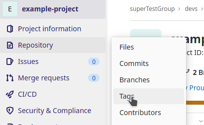
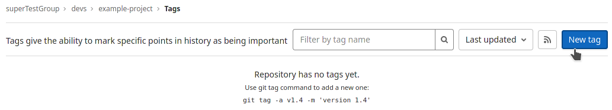
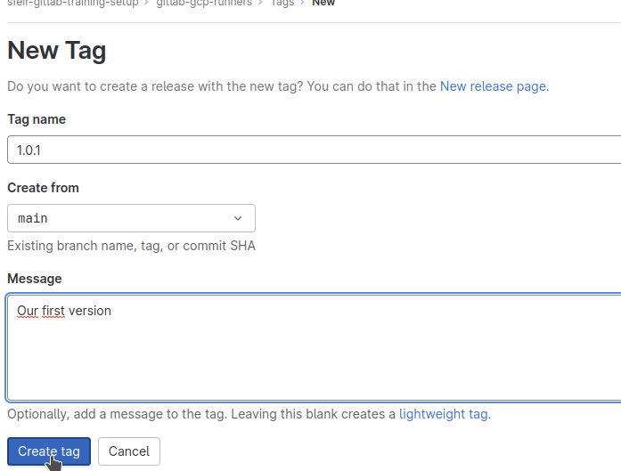
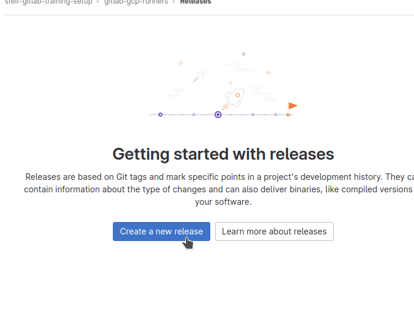
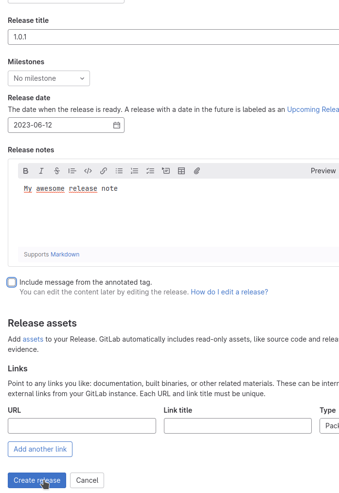
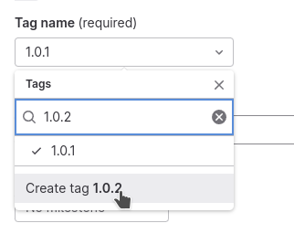

# Releases

## Créer une release

Notre client nous demande de mieux communiquer sur les dernières versions de notre librairie. Nous décidons de mettre en place un processus de release assez simple.

 Les releases gitlab s'appuient sur des tags git. Nous allons donc commencer par en créer un. Il est possible de faire cette action via la ligne de commande (avec le client git) ou bien via l'interface gitlab.

La release est une donnée pure gitlab, qui se rattache à un tag GIT.
L’approche originale consiste à créer un tag puis à créer la release en le rattachant au tag

Depuis quelque temps, il est également possible de créer le tag et la release sur un même écran. Mais la logique est la même.
Nous allons exploiter les 2 phases de création et je vous montrerai l’alternative récemment mis en place par gitlab.

Dans gitlab rejoignez la section Repository > Tags :

Dans cette section cliquez sur New Tag :

Remplissez le formulaire comme suit :

 
Ensuite cliquez sur consulter dans la section **Deployments > Release**

Et attachez le tag précédemment créé à votre nouvelle release.

Notez que dans cet écran, la création de tag est donc également possible

## Recevoir les notifications de release

Notre processus de release étant défini. Nous allons pouvoir indiquer au client la marche à suivre pour se tenir au courant de l'avancement de notre projet.

Il lui suffira de se rendre sur la page d'accueil de notre projet et de cliquer sur le bouton “cloche”

Il pourra ensuite choisir l’option Custom notifications et de ne sélectionner que les informations qui l’intéressent
