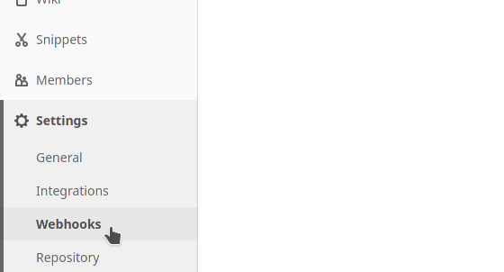
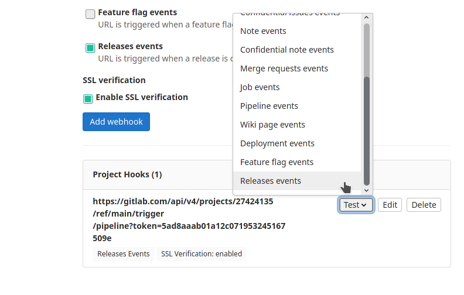
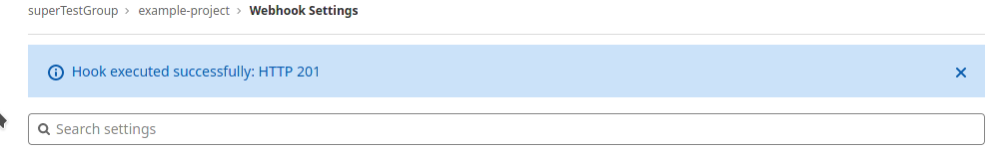

# Webhooks

L’un de nos clients les plus importants utilise notre nouvelle librairie. Comme il aimerait automatiser l’intégration de notre solution à la sienne, il nous demande de le notifier automatiquement à chaque nouvelles releases.

Pour pouvoir faire cela, nous utiliserons les webhooks :

Naviguez jusqu'à la section : Settings > Webhooks

L'écran suivant nous permet de créer un webhook en réponse à un événement qui surviendra dans notre projet.

D'abord remplissons l'url cible de notre webhook :
https://gitlab.com/api/v4/projects/39423141/ref/main/trigger/pipeline?token=TOKEN
Pensez à bien remplacer la partie TOKEN par celui fourni par le client. *En l'occurrence, votre formateur devra vous donner le web-token permettant de lancer un build sur un autre projet.*

Comme nous ne souhaitons notifier notre client que pour les nouvelles releases, nous ne sélectionnons que ce type d'événement.

Si vous êtes curieux, vous pouvez voir le projet publique que l’on appelle:
https://gitlab.com/sfeir-gitlab-training-exercice/training-sessions/webhook-example

Cliquez ensuite sur Add webhook. Afin de vérifier le bon fonctionnement de ce webhook, naviguez jusqu'au bas de la page.

Simulez alors un événement de release :

Gitlab devrait alors vous notifier de la réussite ou de l'échec de la notification

