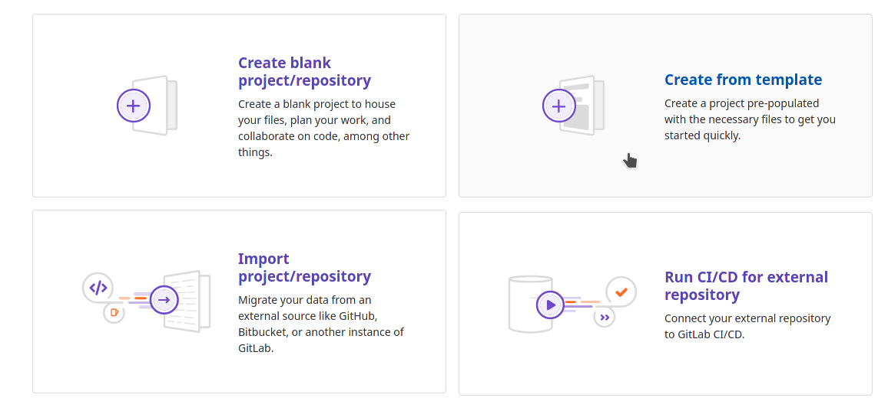
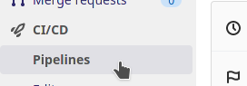
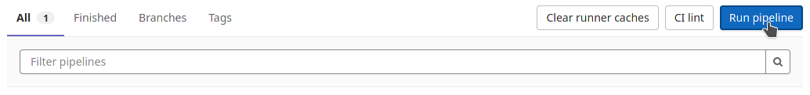
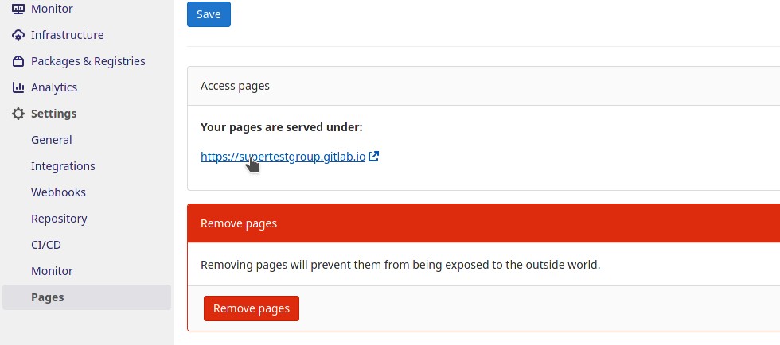

# Publier des packages basiques

Notre entreprise souhaite faire connaître certaines librairie et les partager aux utilisateurs de vos projets.

Nous allons donc revenir sur la CI et faire appel à l’API de gitlab pour publier.

Nous allons simuler la création d’un package basique de type tar compressé de notre base de source et la publier.

Retournez dans votre projet example project

Ajouter dans le fichier *.gitlab-ci.yml* une nouvelle étape:
Notez que nous n’avions pas déclaré les 2 étapes build et test, qui sont mise par défaut.

```yml
stages:
  - build
  - test
  - upload
  - deploy
```

Maintenant créons un package et publions le

```yml
upload:
  stage: upload
  image: curlimages/curl:latest
  script:
    - tar -cvzf package.tar.gz src README.md mvnw* pom.xml
    - 'curl --header "JOB-TOKEN: $CI_JOB_TOKEN" --upload-file package.tar.gz "${CI_API_V4_URL}/projects/${CI_PROJECT_ID}/packages/generic/my_package/0.0.1/package.tar.gz"'
```

Veuillez noter:
Gitlab met à disposition un token pour accéder à l’API de gitlab (**CI_JOB_TOKEN**)
L’URL de l’API est fourni également (**CI_API_V4_URL**)
Le projet est identifié par gitlab sous **CI_PROJECT_ID**
Vous pouvez consulter et télécharger le package dans packages and registries

# GitLab Pages

Notre entreprise commence à avoir une certaine renommée grâce au bouche à oreille. Pour booster un peu notre image de marque, nous souhaiterions mettre en place un site web.

Ce site aura pour vocation de décrire l'entreprise et ses produits.

Pour ce genre de besoins, GitLab met à disposition un hébergement gratuit : GitLab Pages.

## Créer une page

Il est très simple de créer une page grâce aux templates mis à disposition par GitLab. Il est par contre important de connaître l'entité qui sera visée par cette page. Dans le cas de notre entreprise, nous souhaitons créer un site qui parlera de notre organisation.

Le scope sera donc le groupe représentant notre entreprise.

Pour créer cette page, nous allons utiliser un template: ceux-ci contiennent tout ce qu'il faut pour bien commencer: le code, mais aussi le pipeline qui permettra de déployer les nouvelles versions de la page.

Pour commencer sur la page d'accueil de gitlab, cliquez sur **New Project**. Choisissez ensuite Create From Template



GitLab met à disposition une longue liste de template. Dans ceux préfixé par **Pages/**


Le plus simple est le template plain HTML, mais vous pouvez en choisir un plus évolué.

Cliquez sur Use template

 Dans le cas d'une page, le nom du projet est très important: c'est ce nom qui définit l'URL d'accès à cette page. Dans le cas d'une page au niveau du groupe. Il faudra le nommer : <nom_du_groupe>.gitlab.io

Pour déployer la page, nous devrons exécuter une pipeline: celle-ci pourra être lancé par une modification sur la branche par défaut ou comme ceci :



Dans la section Build > Pipelines, cliquez sur **Run Pipeline**



Une fois le job exécuté nous allons pouvoir visualiser notre page. Pour cela, rendez vous directement sur l'url (le nom de notre projet). Si vous avez oublié cette url, sachez qu'elle est disponible dans la section **Deploy > Pages**



Vous admirez enfin le site de notre entreprise.
